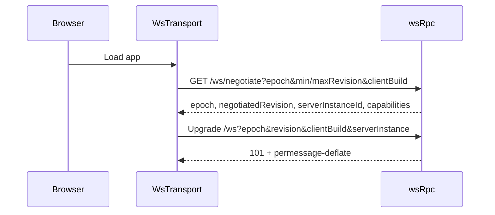

# Transport

How the browser and server talk: connect negotiation, WebSocket compression, and static asset delivery.

Glade's transport was originally built for localhost, where bandwidth is free and latency is negligible. The mechanisms below exist because neither holds over a real network — they are also what makes running a session against a remote host practical.

## Connect negotiation

Connecting is a **single handshake**. The browser first asks `/ws/negotiate` (HTTP) what the server speaks, then opens the feature socket at `/ws` carrying the negotiated answer as query parameters.

`/ws/negotiate` returns the protocol epoch, the negotiated revision, the server's **instance id**, and the capability list. The socket request must echo all of it back.

`validateWsFeatureCompatibility` ([`wsCompatibility.ts`][2]) rejects a mismatch with **HTTP 426** and a typed reason:

| Condition                            | Reason                    | Client action |
| ------------------------------------ | ------------------------- | ------------- |
| Epoch differs, or parameters missing | `WS_NEGOTIATION_REQUIRED` | reload        |
| Revision below the server's minimum  | —                         | update client |
| Revision above the server's maximum  | —                         | update server |
| `serverInstanceId` does not match    | `WS_NEGOTIATION_REQUIRED` | reload        |

The instance id is a fresh UUID per server boot. That is what makes a restart mid-negotiation detectable: a client holding credentials from a previous server generation is told to reload rather than silently talking a stale protocol against a new process. A 426 on `/ws` is therefore **expected behaviour** for any client that has not negotiated — not a fault.

## Recovery and interrupted sends

HTTP negotiation discards unusable error bodies before entering the bootstrap socket fallback. HTTP 426 still decodes the typed incompatibility response within the negotiation deadline; authentication failures stop recovery. Voice upload uses its RPC fallback on 404/405 without reading the response body. A successful response must decode as the shared transcription result; an invalid one is reported to the composer as an error. Other upload failures and invalid responses never trigger another transcription request. Attachment and voice upload errors carry the same CORS headers as successes, and only for a verified origin, so the browser can read the actual error; a rejected origin gets none.

Recoverable feature RPC protocol errors rebuild the complete client through the reconnect owner. Recovery immediately fences old callbacks and retry timers, closes the old scope/runtime before replacing it, probes the feature connection, and restores subscriptions. Terminal creation continues to wait for terminal-output readiness. Thread resume cursors remain scoped to the server generation. Disposal cancels connection and settlement work; permanent incompatibility or authentication failures remain visible.

Clients require `orchestration.turn-dispatch-settlement`. After a lost or timed-out turn-start acknowledgement, they send `orchestration.settleTurnDispatch` with the original command identity and content, never another turn start. The engine serializes settlement with normal dispatch. An existing accepted receipt returns its original sequence; otherwise settlement writes a durable rejection that fences delayed arrivals. Receipts bind the command fingerprint, thread and authenticated session. Settlement cannot claim attachments, and receipts without stored caller evidence cannot authorize it. Migration 5 adds caller evidence without rewriting existing receipts.

Settlement has four RPC slots independent of ordinary command saturation and uses the engine's bounded control reserve. It remains admissible while quiescing and is refused while draining or stopped. The client permits at most three settlement attempts, each bounded to 25 seconds, within a 90-second recovery deadline. Exhaustion stays visibly uncertain and blocks both composer submission and automatic queued sends. The thread submission owner retains the original command, draft and staged uploads across navigation. Confirmed acceptance consumes only captured draft content; confirmed rejection preserves newer input and compensates owned uploads once. Unknown delivery never triggers compensation or automatic resend. Staged uploads retain their server expiry.

An accepted orchestration receipt proves app-command acceptance. Provider transitions still wait for their native first-turn acceptance before consuming the preserved draft; see [provider-architecture.md](provider-architecture.md).

Git stacked actions (commit, push, PR) run under a server-owned registry, not the request: a dropped socket neither cancels nor repeats the mutation. Servers advertising `git.action-reattach` accept `git.runStackedAction` with `resume: true`, which only reattaches to the original action ID and never starts a missing one. Reattachment requires the same caller and input fingerprint; another session or different input under the same ID is rejected. A late observer receives the current action, phase and hook state, the latest output line and, once settled, the final result or failure; slow observers lose older output lines, never the outcome. The server retains the 64 most recent settled outcomes in memory. Server shutdown interrupts running actions; for remote sessions, revocation or expiry stops them even while disconnected. The client reattaches after transport loss with backoff, and reports an unknown outcome instead of resending when the server lacks the capability, has restarted, or no longer holds the result.

## Connection liveness

A missed keepalive cannot tell a busy server from a broken path, so the client does not replace an open socket because one pong is late. It sends a keepalive every 5 seconds and treats **any server frame** as proof of life, including a pong queued behind a large snapshot. Only **180 seconds of complete silence** fails the socket and starts the existing reconnect owner; socket errors and closes still recover immediately. WebSocket upgrades and the feature readiness probe each allow 90 seconds, which outlasts the 45 to 60 second stalls seen under heavy load. A refused connection fails at once, and an incompatible server still stops recovery with its typed reason.

A liveness tick that runs more than three ticks late means the renderer or the machine was paused (sleep, background throttling). The client then restarts its silence and responsiveness windows instead of blaming the server. These budgets do not change request deadlines, and nothing here resends a mutation.

## Server busy notice

A keepalive left unanswered for 3 seconds with no other frame marks the server as not responding; the next frame clears it. This uses the keepalive that already runs, so a hidden window does no extra polling. Unary requests still pending after 15 seconds count as slow (120 seconds for requests without a deadline, three quarters of the deadline above 60 seconds); at most 256 are tracked per transport. Neither signal reconnects, retries or resends anything.

The server samples its event loop with Node's `monitorEventLoopDelay` (20 ms resolution, read once per second). A delay of at least 2 seconds counts as a stall only when event-loop utilization shows the loop was busy for that long; a delay without that evidence (system sleep, descheduling) is counted as an idle gap and never reported as a stall. Stall warnings are logged at most once per 30 seconds with a suppressed count. Under Bun, which reports no utilization, the monitor reports itself unavailable. Servers advertising `server.runtime-status` answer `server.getRuntimeStatus` with aggregate counters only; it is admitted as control traffic. The client asks once, after a not-responding episode ends, and names the stall duration only when a stall that recent explains the wait. No status leaves the machine.

The composer shows one connection notice, chosen in `ComposerConnectionNotice.logic.ts`: reconnecting, then server not responding, then paused chat or workspace updates, then slow requests, then a short recovery note. Reconnecting appears only after 1.5 seconds of continuous outage and clears as soon as the connection opens. Incompatible servers keep the full-screen view. The notice sits outside the editor and the transcript, so it never moves focus, touches the draft or drives auto-follow.

## Bounded subscriptions

Snapshot-backed streams (shell, thread detail) never drop events silently. From the moment a subscription attaches, its live events are counted against **1,024 events and 8 MiB of serialized JSON**, including events that arrive while the snapshot loads and the last delivered chunk until the client acknowledges it. Exceeding either bound frees the retained events, stops that subscription's producer and fails it with the retryable `WS_STREAM_OVERFLOW` code, also before a pending snapshot is sent. Lifecycle, settings, provider and keybinding streams use the same code when their sliding buffer overflows.

A cursor resume replays at most 4,096 events and **2 MiB** of serialized JSON, read before anything is sent; a larger gap falls back to a fresh snapshot in the same stream. Replay after a snapshot is pulled from the journal chunk by chunk under acknowledgement and is bounded by event count.

The client restarts only the overflowing subscription, keeping its last applied cursor and every other stream on the socket. Retries wait 250 ms doubling to 16 seconds, at most eight times; only a stream that stays up for 10 seconds earns a fresh budget, since a snapshot alone does not prove recovery. After that the thread is marked failed or workspace updates are marked paused, and the composer offers **Retry updates**, which resubscribes that stream from its cursor. Delivery from the recovered stream itself clears the state; a catch-up poll does not. Other streams fall back to a full reconnect only after exhausting the same budget.

## WebSocket compression

`permessage-deflate` is negotiated on the feature socket with **context takeover**, so each frame is compressed against the window left by previous frames. Orchestration traffic is highly repetitive JSON — the same envelope keys with a few fields changed — so the repeated structure costs almost nothing after the first message. Measured against representative orchestration frames, this is roughly a 79% reduction.

Two safety properties matter more than the ratio:

- **`maxPayload` is enforced on the decompressed size.** Compression cannot be used to smuggle an oversized frame past the limit.
- **Compression is negotiated only on the feature socket path.** The dispatch in [`nodeHttpServer.ts`][1] fails closed: a socket on any other path gets no compression rather than silently inheriting it. `upgradePathAllowsCompression` is the single point that decides this.

## Static assets

The build emits `.br` and `.gz` sidecars next to each asset. [`staticAssets.ts`][3] serves the best encoding the client actually accepts, falling back to identity.

| Encoding | Full bundle | Reduction |
| -------- | ----------- | --------- |
| identity | 18.09 MB    | —         |
| gzip     | 4.44 MB     | 75.4%     |
| brotli   | 3.63 MB     | 79.9%     |

Details that are easy to get wrong and are therefore tested:

- **`Accept-Encoding` parsing ranks `identity` among the codings** rather than special-casing it, so `identity;q=0` and `br;q=0` both behave per RFC 9110. An encoding explicitly refused with `q=0` is never served.
- **Conditional requests** use weak comparison for `If-None-Match`, and the ETag varies by encoding — a brotli response and an identity response of the same file are different entities.
- **Cache lifetime follows content addressing.** Hashed assets are `public, max-age=31536000, immutable`; `index.html` is `no-cache`. Caching the entry document would pin a browser to a stale bundle, so it is deliberately excluded.

## Thread subscription and cursor resume

Subscribing to a thread can **resume from a cursor** instead of refetching full history ([`threadDetailResumeCursors.ts`][4]).

Resume is fenced by a high-water mark. The server trusts a cursor only when the subject thread still exists, the gap to the journal head is non-negative (hard purges can lower the head below a cursor a client legitimately held), and the gap fits the replay limit. Any other cursor falls back to the full-snapshot path **inside the same stream** — the client is served a snapshot as if it had never sent a cursor, with no extra round trip. (`ORCHESTRATION_RESNAPSHOT_REQUIRED` is the snapshot path's own fence for a replay that can no longer cover its gap; the resume shortcut never emits it.) The fence is deliberately conservative: a redundant snapshot is wasteful, a stale delta is wrong, so any doubt resolves toward the snapshot.

The `afterSequence` field is optional on the subscribe input, so an older client simply never sends it and receives full snapshots exactly as before.

Cursor state also gates sidebar prewarming: a speculative prewarm subscription is only cheap when it can resume from a cursor, so threads without cached detail are not prewarmed from scroll position and pay their first full snapshot when actually opened. That trades a slightly colder first open of a never-viewed thread for not spending the per-client thread-stream budget on full-history streams the user may never look at.

[1]: ../apps/server/src/server/http/nodeHttpServer.ts
[2]: ../apps/server/src/server/ws/wsCompatibility.ts
[3]: ../apps/server/src/server/http/staticAssets.ts
[4]: ../apps/web/src/threadDetailResumeCursors.ts

Terminal event streams emit `ready` after the server registers the output
subscriber. The client waits for this barrier before `terminal.open`; reconnects
reset it. Terminal snapshots and output chunks include a monotonically increasing
`outputSequence` for the running session. While opening, the client buffers live
chunks and replays only chunks newer than the snapshot, preserving output when
a PTY starts before its viewport mounts. This contract requires protocol revision 3.

Automatic terminal input such as the `cd` sent by **Open Path in Terminal** uses
`terminal.write` with `onlyIfIdle`. Under the thread's terminal lock, the server
takes a fresh process snapshot and refuses the write when the session runs a
subprocess or managed agent, received user input during the check, changed
identity, or could not be inspected. The client's running state is only a hint.
Clients require the `terminal.idle-input` capability because older servers would
ignore the flag. Ordinary keystrokes are not checked. An explicit
`terminal.close` keeps the client's tile, xterm and history until the server
confirms; a failed close stays visible and never becomes an `exit` write.
